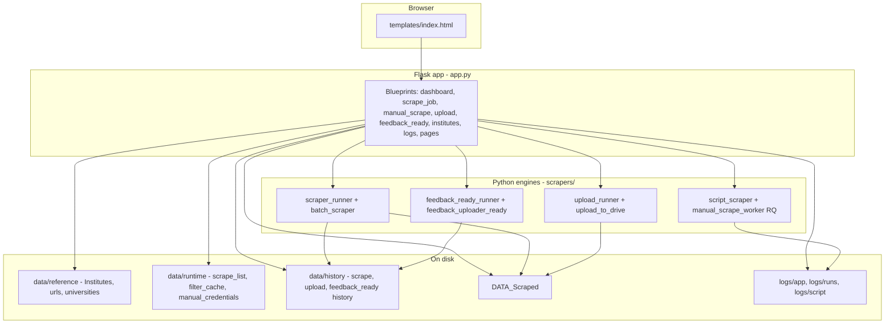

# NPF Scraper Web App — Complete Project Guide

This document describes **how the project works**, its **folder structure**, **data flow**, **APIs**, **scrapers**, **credentials**, **logs**, and **operational processes**. It is the single reference for onboarding and maintenance.

---

## 1. What this project does

| Capability | Description |
|------------|-------------|
| **Batch scrape (Jobs)** | For each university in `scrape_list.json`, logs into NPF publisher, opens **Campaign Detailed View**, applies **Paid Application** filters and date range, paginates leads, saves **CSV** under `DATA_Scraped/<dd-mm-yy>/<University>/`. |
| **Manual scrape (web UI)** | Same Script_Scraper–style flow: Flask **enqueues** jobs on **Redis/RQ**; **worker processes** run Playwright **headless** with per-job dirs under **`data/runtime/manual_jobs/<job_id>/`**. Filter discovery still runs briefly in Flask. **Skips** Campaign Detailed View for manual paths. |
| **Upload to Google Drive** | Uploads local `DATA_Scraped/<date>/` institute folders to a configured Drive root; tracks per-date **upload history** (folder IDs). |
| **Feedback Uploader Ready** | Reads scraped CSVs **from Drive** (by date), transforms rows into a fixed column layout, writes output to Drive and/or `Feedback_Uploader_Ready_Output/`. |
| **Dashboard** | Shows per-date, per-institute **scrape** and **upload** status using `DATA_Scraped`, `scrape_history.json`, and `upload_history.json`. |
| **Institutes list** | Master list in `data/reference/Institutes.json`; used to merge URL/email into scrape list rows (passwords from `.env`). |

---

## 2. High-level architecture



- **Flask** serves the SPA-style UI and JSON APIs.
- **Long jobs** (scrape, upload, feedback-ready) run in **background threads**; the UI **polls** status endpoints.
- **Paths** are centralized in **`project_paths.py`** (not scattered in routes).

---

## 3. Repository layout (npf-scraper-webapp)

```
npf-scraper-webapp/
├── app.py                      # Flask entry: create_app(), run on :5000
├── project_paths.py            # ALL paths: data/*, logs/*, DATA_Scraped, templates
├── credential_env.py           # .env loading, NPF_PASSWORD_*, merge manual credentials
├── institute_helpers.py        # Sanitize API payloads, enrich rows from Institutes.json
├── requirements.txt            # flask, dotenv, playwright, pandas, google-api-client
├── .env / .env.example         # Secrets and optional tuning (not committed)
│
├── data/
│   ├── README.md               # data/history, reference, runtime explained
│   ├── history/                # scrape_history, upload_history, feedback_ready_history
│   ├── reference/              # Institutes.json, manual_institutes, urls, universities (TSV)
│   └── runtime/                # scrape_list.json, filter_cache, manual_credentials, credentials.json?, exports/
│
├── logs/
│   ├── app/                    # scraper.log, batch_scraper.log, upload.log, manual_scrape.log, feedback_ready.log
│   ├── runs/<dd-mm-yy>/        # Per-institute scrape logs (Jobs batch)
│   └── script/                 # script_scraper_*.log (desktop or dev)
│
├── DATA_Scraped/               # Batch: <dd-mm-yy>/<University>/*.csv (manual web UI writes to OS Downloads, not here)
├── Feedback_Uploader_Ready_Output/   # Optional local mirror of transformed CSVs
├── templates/
│   └── index.html              # Single-page UI (dashboard, jobs, manual, upload, feedback-ready, settings)
│
├── webapp/
│   ├── __init__.py             # create_app(): load dotenv, ensure_layout_migrated, register_blueprints
│   ├── config.py               # Re-exports paths + SCRAPE_LIST_MAX_LENGTH (100)
│   ├── state.py                # manual_scrape_status dict (running, error, output_path, …)
│   ├── routes/                 # One blueprint per UI section (see §6)
│   └── services/
│       ├── json_store.py       # load/save scrape_list, histories, filter_cache
│       └── path_utils.py       # safe log paths, safe manual output folder names
│
├── scrapers/
│   ├── batch_scraper.py        # Playwright: paid application flow → CSV (used by Jobs)
│   ├── scraper_runner.py       # Reads scrape_list, loops universities, updates scrape_history, logs
│   ├── script_scraper.py       # Tk GUI OR run_headless() for web manual scrape
│   ├── npf_post_login.py       # ensure_campaign_detailed_view (Jobs + desktop script)
│   ├── export_columns.py       # drop_phone_mobile_columns before CSV write
│   ├── upload_to_drive.py      # Google Drive upload from DATA_Scraped
│   ├── upload_runner.py        # Threaded upload job + upload_history + upload.log
│   ├── feedback_uploader_ready.py   # Transform Drive CSVs → feedback-ready format
│   └── feedback_ready_runner.py     # Threaded feedback-ready job + feedback_ready.log
│
├── script_scraper.py           # Duplicate entry (root) for standalone EXE / legacy; mirrors scrapers/script_scraper.py
└── tools/
    └── strip_passwords_from_data.py  # Scrub pass fields in JSON/TSV
```

---

## 4. Path & migration model (`project_paths.py`)

- **`ensure_layout_migrated()`** runs on app startup (and some scraper entry points). It **moves** legacy flat files:
  - `data/*.json` → `data/history/`, `data/reference/`, or `data/runtime/` as appropriate
  - `logs/*.log` → `logs/app/`
  - `logs/<dd-mm-yy>/` → `logs/runs/<dd-mm-yy>/`
  - `script_scraper_*.log` → `logs/script/`

**Never hardcode** `data/Institutes.json`; always use `project_paths` / `webapp.config`.

---

## 5. Environment variables (`.env`)

| Variable | Purpose |
|----------|---------|
| `NPF_PASSWORD_CENTRAL` | Password for central.crm@collegedunia.com profile |
| `NPF_PASSWORD_SANJAY` | Password for sanjay profile |
| `NPF_PASSWORD_AMIT` | Password for amit profile |
| `NPF_DETAILED_VIEW_SETTLE_MS` | Optional ms to wait after Detailed View (default 2500); used by `npf_post_login.py` |
| `NPF_MANUAL_SCRAPE_MAX_LEADS` | Max “Primary Leads” before manual scrape aborts (default 100000); `0` = disable |
| `BRIGHT_DATA_PROXY_SERVER` | Optional override for Bright Data proxy server in batch scrape (e.g. `http://brd.superproxy.io:33335`) |
| `BRIGHT_DATA_PROXY_USERNAME` | Optional Bright Data username override for batch scrape |
| `BRIGHT_DATA_PROXY_PASSWORD` | Optional Bright Data password override for batch scrape |
| `DRIVE_FOLDER_ID` | Google Drive root for uploads / feedback source (see upload & feedback modules) |
| `DRIVE_SOURCE_DATA_FOLDER_NAME` | Optional subfolder name under Drive root for scraped data |
| `FEEDBACK_READY_ROOT_ID` | Target Drive root for feedback-ready output |
| `FEEDBACK_READY_FOLDER_NAME` | Target folder name (default `Feedback Uploader Ready`) |
| `FEEDBACK_READY_SKIP_HISTORY` | Set to `1` to re-process institutes already in feedback_ready_history |
| `REDIS_URL` | Redis for manual scrape job queue (default `redis://127.0.0.1:6379/0`) |
| `MANUAL_SCRAPE_RQ_QUEUE` | RQ queue name (default `manual_scrape`) |
| `MANUAL_SCRAPE_JOB_TIMEOUT_SEC` | Per-job asyncio + RQ timeout hint (default `1800`) |
| `MANUAL_SCRAPE_TRANSIENT_RETRIES` | Worker retries for `TIMEOUT` / `NETWORK_ERROR` (default `3`) |
| `MANUAL_SCRAPE_HEADLESS` | `1` (default) = headless Chromium in RQ jobs; `0` = visible browser (local debug) |

Copy **`.env.example`** → **`.env`** locally. `.env` is gitignored.

---

## 6. Web app ↔ routes ↔ APIs

| UI section | Blueprint module | Main endpoints |
|------------|------------------|----------------|
| Home page | `routes/pages.py` | `GET /` → `index.html` |
| Dashboard | `routes/dashboard.py` | `GET /api/dashboard-dates`, `/api/dashboard-stats?date=`, `/api/scrape-history` |
| Institutes | `routes/institutes.py` | `GET /api/institutes` (sanitized, no passwords) |
| Jobs (scrape list + run) | `routes/scrape_job.py` | `GET/POST/DELETE /api/scrape-list`, `POST /api/run-scrape`, `GET /api/scrape-status`, `POST /api/scrape-retry` |
| Manual scrape | `routes/manual_scrape.py` | `GET /api/manual-scrape/urls`, `POST /filters`, `/subfilter-options`, `/run` (enqueue), `GET /status?job_id=`, `POST /cancel`, `/download?job_id=&file=` |
| Upload | `routes/upload.py` | `GET /api/upload-dates`, `POST /api/upload-to-drive`, `GET /api/upload-status` |
| Feedback ready | `routes/feedback_ready.py` | `GET /api/feedback-ready-dates`, `/files`, `POST /run`, `GET /status` |
| Stop jobs | `routes/stop_jobs.py` | Cooperative cancel (see below) |
| Logs (Settings) | `routes/logs.py` | `/api/scraper-logs/dates`, `/files?date=&kind=` (`scrape` / `upload` / `manual` / `feedback`), `/api/scraper-logs?date=&file=`; legacy `/api/*-logs` still exist |
| Settings (auth info) | `routes/settings_info.py` | `GET /api/settings/auth-summary` (paths & flags only, no secrets) |

**Stop / cancel (cooperative):** All are `POST` with an empty JSON body.

| Endpoint | Effect |
|----------|--------|
| `POST /api/stop/scrape` | Batch scrape and dashboard **Run paid scrape** stop after the **current university**. |
| `POST /api/stop/manual` | Optional JSON `{"job_id":"<uuid>"}` to cancel one RQ job; if omitted, cancels **all** active manual jobs (and legacy in-process stop flag). |
| `POST /api/stop/upload` | Upload stops after the **current file**. |
| `POST /api/stop/feedback-ready` | Feedback-ready job stops after the **current file**. |
| `POST /api/stop-all-scrapers` | Signals all of the above in one call. |

The UI places a **Stop** control next to each job’s Run button; Dashboard includes **Stop scrape** for the same scrape engine as Jobs.

**Security note (from `webapp/README.md`):** API responses strip password-like fields, but anyone who can hit your Flask port can still abuse APIs. Use localhost/VPN/HTTPS and real auth for production.

---

## 7. Credentials flow

1. **`credential_env.load_npf_dotenv()`** loads `.env` once (does not override existing OS env).
2. **`password_for_profile("central"|"sanjay"|"amit")`** reads `NPF_PASSWORD_*`.
3. **`password_for_email(email)`** maps known institute emails to the same env keys.
4. **`ensure_row_password(row)`** mutates scrape/batch rows: if `pass` empty, fill from email → env (used by `batch_scraper`).
5. **`merge_manual_credentials_from_env`** builds the dict used by manual scrape from `manual_credentials.json` + env.
6. **Scrape list POST** stores **sanitized** rows (no passwords on disk); at scrape time, **`enrich_row_from_institutes`** + **`.env`** supply secrets server-side only.

---

## 8. Process flows (step by step)

### 8.1 Jobs: batch scrape (`scraper_runner` + `batch_scraper`)

1. User adds universities via **`/api/scrape-list`** (merged from `Institutes.json`).
2. **`POST /api/run-scrape`** starts **`run_scrape_job(headless=...)`** in a thread.
3. For each row in `scrape_list.json`:
   - Skip if **already scraped today** with success and `recordCount > 0` (see `scrape_history.json`).
   - Launch Chromium (visible unless `headless: true`).
   - Login → **`ensure_campaign_detailed_view`** → institute → source → date range → **Paid Applications = Yes** → Search.
   - Paginate / capture API or DOM → build DataFrame → **`drop_phone_mobile_columns`** → insert `pcid` / `FI` if applicable → **`to_csv`** under `DATA_Scraped/<today dd-mm-yy>/<University>/`.
4. Append per-institute log under **`logs/runs/<dd-mm-yy>/<safe_name>.log`**; main job log **`logs/app/scraper.log`**.
5. Update **`data/history/scrape_history.json`** per university (last date, success, count, error).

### 8.2 Dashboard

1. **`/api/dashboard-dates`**: union of folder names under `DATA_Scraped` (excluding `manual`), keys in `upload_history`, and `lastScrapeDate` values in `scrape_history`.
2. **`/api/dashboard-stats?date=dd-mm-yy`**: for each institute in scrape history (and related rules in code), compute scrape status, upload status (folder ID in history for that date), Drive link, retry flag for failed paid scrape.

### 8.3 Manual scrape (web) — Redis + RQ workers

1. **`GET /api/manual-scrape/urls`**: reads `data/reference/urls.json` and populates the Manual URL dropdown (with a Custom URL option in UI).
2. Manual form defaults:
   - **From date** = yesterday
   - **To date** = today
   - Format is **`DD-MM-YYYY`**
3. **`POST /api/manual-scrape/filters`** / **`subfilter-options`**: still run **in the Flask process** (short-lived Playwright, `headless=False` for filter discovery); **`skip_campaign_detailed_view`** so Detailed View is **not** used.
4. **`POST /api/manual-scrape/run`**: **does not** run the scraper in Flask. It enqueues **`scrapers.manual_scrape_worker.run_manual_scrape_worker`** on queue **`manual_scrape`** (Redis **`REDIS_URL`**, default `redis://127.0.0.1:6379/0`). Response includes **`job_id`** (UUID).
5. **Workers:** start one or more processes from **`npf-scraper-webapp`**:  
   `rq worker -u <REDIS_URL> manual_scrape`  
   (see **`scripts/run_manual_scrape_worker.bat`** / **`.sh`**). Each job uses **`data/runtime/manual_jobs/<job_id>/`** ( **`output.csv`**, **`screenshot.png`**, **`logs.txt`**, **`browser_profile/`** ) and **`logs/manual_jobs/<job_id>.txt`**.
6. Workers run Playwright **headless** with **`--no-proxy-server`** for manual paths (same as before).
7. **Cancel:** worker polls **`job.meta["cancel"]`** (set by **`POST /api/manual-scrape/cancel`** or **`POST /api/stop/manual`** with **`job_id`**). **`POST /api/stop-all-scrapers`** requests cancel on all jobs in Redis set **`manual_scrape:active_jobs`**.
8. **Status:** **`GET /api/manual-scrape/status?job_id=`** — progress and **`error_code`** (e.g. `INSTITUTE_NOT_FOUND`, `TIMEOUT`, `NETWORK_ERROR`, `LEADS_LIMIT_EXCEEDED`, `CANCELLED`).
9. **Download:** **`GET /api/manual-scrape/download?job_id=&file=output.csv`** (or **`screenshot.png`**, **`logs.txt`**). Legacy **`?file=`** under Downloads and **`?path=`** under `DATA_Scraped` remain.
10. If **Primary Leads** count **> `NPF_MANUAL_SCRAPE_MAX_LEADS`**, job fails with code **`LEADS_LIMIT_EXCEEDED`**.
11. **Transient retries** (timeouts / network): worker retries up to **`MANUAL_SCRAPE_TRANSIENT_RETRIES`** (default 3). Logical errors are not retried.

### 8.4 Upload to Drive

1. **`POST /api/upload-to-drive`** with `date` (defaults to today `dd-mm-yy`).
2. **`upload_runner.run_upload_job`**: loads **`upload_history.json`** for that date (already-uploaded folder IDs), calls **`upload_date_to_drive`**, merges new folder IDs, saves history, appends **`logs/app/upload.log`**.

**Credentials:** service account JSON — prefer `../NPF paid application/credentials.json` else **`data/runtime/credentials.json`**.

**Date naming:** local folders use **`dd-mm-yy`**; Drive folders use **`YYYY-MM-DD`** (conversion in `upload_to_drive.py`).

### 8.5 Feedback Uploader Ready

1. **`/api/feedback-ready-dates`**: from **`upload_history`** keys.
2. **`/api/feedback-ready/files?date=`**: lists Drive files for that date via **`feedback_uploader_ready.list_files_for_date`**.
3. **`POST /api/feedback-ready/run`**: **`run_feedback_ready_job`** (optional `fileIds` for subset).
4. Transforms CSVs; records successful institutes in **`data/history/feedback_ready_history.json`** per date (skippable via `FEEDBACK_READY_SKIP_HISTORY`).
5. Local output may go under **`Feedback_Uploader_Ready_Output/`** (see `DEFAULT_LOCAL_OUTPUT_DIR` in script).

### 8.6 Logs (Settings UI)

- **Logs history** (Settings): one **date** picker; four panes (scrape / upload / manual / feedback) each use **date + file list + content**, same layout as the former scrape-only viewer.
- **Directory:** **`logs/runs/<dd-mm-yy>/`**
  - **Scrape:** `<Institute>.log` (no prefix).
  - **Upload:** `upload_<Institute>.log`, job summary **`upload_job.log`**.
  - **Manual:** `manual_<Institute>.log`, **`manual_job.log`** for lines without a specific institute.
  - **Feedback:** `feedback_<Institute>.log`, **`feedback_job.log`** for job-level lines.
- **Aggregate app logs** (still appended): **`logs/app/scraper.log`**, **`upload.log`**, **`manual_scrape.log`**, **`feedback_ready.log`**.

---

## 9. Scraper engines (technical)

### 9.1 `batch_scraper.py` (Jobs)

- **Playwright** async; **Paid Application** campaign detailed view path.
- **CSV:** `export_columns.drop_phone_mobile_columns` — removes phone/mobile/whatsapp-style columns only; **keeps name, email**, etc.
- **Proxy:** Bright Data proxy is enabled by default; can be overridden via `BRIGHT_DATA_PROXY_SERVER`, `BRIGHT_DATA_PROXY_USERNAME`, `BRIGHT_DATA_PROXY_PASSWORD` (all three required).
- Logging: **`logs/app/batch_scraper.log`**.

### 9.2 `script_scraper.py` (manual + legacy desktop)

- **`ScraperApp(root=Tk)`**: desktop GUI; **uses** `ensure_campaign_detailed_view` after login.
- **`ScraperApp(root=None)`**: web manual; **`skip_campaign_detailed_view = True`**.
- **`run_headless`**: used only from Flask manual route; stubs `messagebox` so dialogs don’t block; errors must propagate as exceptions or status.

### 9.3 `npf_post_login.py`

- Navigates **Campaigns → Detailed View** (`/campaign/details`) or direct URL fallback; waits for combobox + **settle** (`NPF_DETAILED_VIEW_SETTLE_MS`).

---

## 10. JSON state files (conceptual schema)

| File | Role |
|------|------|
| **`scrape_history.json`** | `{ "<University name>": { lastScrapeDate, success, recordCount, filename?, lastError? } }` |
| **`upload_history.json`** | `{ "<dd-mm-yy>": { uploaded, failed, uploadedAt, folderIds: { "<University>": "<driveFolderId>" } } }` |
| **`feedback_ready_history.json`** | `{ "<dd-mm-yy>": ["University A", ...] }` institutes fully processed |
| **`scrape_list.json`** | Array of job rows (university, url, source, email, …) — passwords stripped on save |
| **`filter_cache.json`** | Cached manual-scrape filter payloads per institute/source |
| **`manual_credentials.json`** | Profile → email (passwords from env at runtime) |

---

## 11. Dependencies & local setup

```bash
cd npf-scraper-webapp
python -m venv .venv
.venv\Scripts\activate   # Windows
pip install -r requirements.txt
playwright install chromium
copy .env.example .env   # then edit passwords + optional Drive IDs
python app.py            # http://127.0.0.1:5000
```

- **Flask reloader** is discouraged for scrape threads (see `webapp/__init__.py` comment).
- **Google Drive**: service account must have access to target Shared Drives/folders.

---

## 12. Relationship to older NPF folders

- Logic is derived from **NPF paid application** / **NPF - upgraded** scripts (e.g. `Script_Scraper.py.py`, `Batch_Scraper.py`).
- This web app **centralizes paths**, adds **Flask UI**, **history**, **upload**, and **feedback-ready** pipeline.
- **1 lakh lead guard** in manual/batch UI matches the upgraded script behavior; web manual uses **`ManualScrapeLeadsLimitExceeded`** + env **`NPF_MANUAL_SCRAPE_MAX_LEADS`**.

---

## 13. Quick troubleshooting

| Symptom | Check |
|---------|--------|
| Playwright fails | `pip install playwright` && `playwright install chromium` |
| Login works but no institute list | `NPF_DETAILED_VIEW_SETTLE_MS` (Jobs); manual web skips detailed view — ensure post-login URL still shows leads UI |
| Upload fails | Service account JSON path, `DRIVE_FOLDER_ID`, Shared Drive membership |
| Dashboard empty dates | `DATA_Scraped` folder names, or history JSON paths after migration |
| Old data paths | Run app once to trigger **`ensure_layout_migrated()`** |

---

## 14. Document maintenance

When you add a new route, scraper, or env var:

1. Update **`project_paths.py`** if new on-disk locations are needed.
2. Register blueprint in **`webapp/routes/__init__.py`**.
3. Update **`.env.example`** and this **`docs/PROJECT_GUIDE.md`**.

---

*Generated for the NPF Scraper Web App codebase. For short README-style notes, see `README.md` and `webapp/README.md`.*
